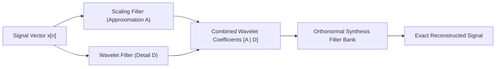

# Discrete Wavelet Transform (Haar DWT) Skill

Orthogonal multi-resolution spatial-frequency decomposition using Haar scaling and wavelet filter banks.

## Features
- **100% Python Standard Library**: Orthonormal basis decomposition.
- **Simultaneous Time-Frequency Localization**: Captures transient edges and steps.
